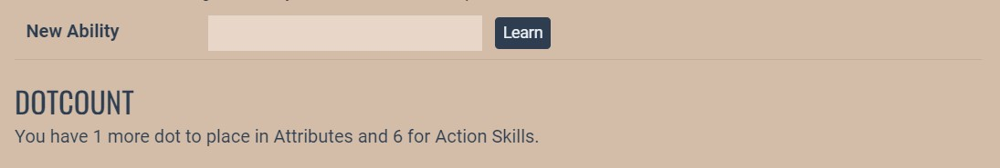

# Dotcount

## Credit

This plugin was coded by Ren @ AresCentral, inspired by a similar command that existed on Gray Harbor.

## Overview

For games using FS3, the Dotcount command allows a player to monitor the status of their stats with respect to the game's cap for Attributes and Action Skills. For example:

    +--- O~~m -------------------------------------------------------------------+
    Total dots on Ren's sheet:
         Attributes...........15 / 20
         Action Skills........55 / 60
         Current XP............4 / 10
    +------------------------------------------------------------------- O~~m ---+

or

    +--- O~~m -------------------------------------------------------------------+
    Total dots on Ren's sheet:
         Attributes...........15 / 19
         Action Skills........55 / 60
         Current XP............4 / 10

    An Attribute at Poor lowers the Attribute cap by 1.
    +------------------------------------------------------------------- O~~m ---+
      

## Web Portal

To show this information on the web profile, some manual editing is necessary. Please see the 'Installation' section for details.


## Installation

1. In the game, run `plugin/install https://github.com/SerendipityJones/ares-dotcount-plugin`.

#### If you only want this for client users, you can stop there. To add it to the bottom of the XP tab on character profiles:

2. Edit `aresmush/plugins/profile/custom_char_fields.rb` (you can do this from the web portal's custom code area) to add `dotcount: Dotcount.web_dotcount(char.name)` to `self.get_fields_for_viewing`. If you haven't added any other custom fields, that section should end up looking like:

``` 
    def self.get_fields_for_viewing(char, viewer)
        return {
            dotcount: Dotcount.web_dotcount(char.name)
        }
    end
```

3. Edit `ares-webportal/app/templates/components/fs3-xp.hbs` (you will need to ssh into your shell for this one) and add this to the end:

```
{{#if this.char.custom.dotcount}}
  <div class="dotcount">
    <hr/>
    <h2>Dotcount</h2>
    {{{this.char.custom.dotcount}}}
  </div>
{{/if}}
```

This will result in the bottom of the XP tab looking something like this:


Please be aware it will only show up for a character whose sheet shows at least one dot above baseline in Attributes or Action Skills.

## Uninstalling

Removing the plugin requires some code fiddling.  See [Uninstalling Plugins](https://www.aresmush.com/tutorials/code/extras.html#uninstalling-plugins).


## License

Same as [AresMUSH](https://aresmush.com/license).
